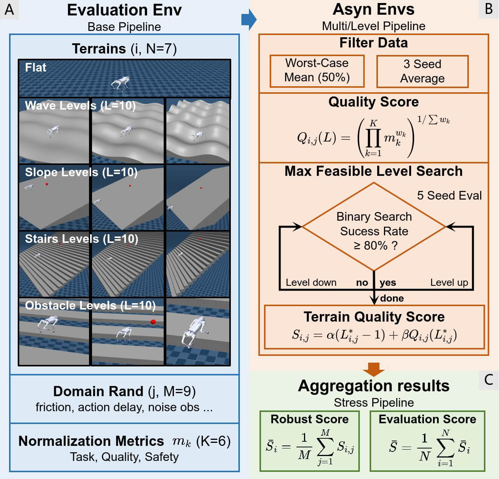

<div align="center">
	<h1 align="center">RoboGauge</h1>
	<p align="center">
		<span>🌎 English</span> | <a href="README_zh.md">🇨🇳 中文</a>
	</p>
</div>

This repository provides a suite of **motion-control evaluation for reinforcement-learning locomotion policies**. The goal is to measure the following aspects of a policy, so we can partially predict Sim2Real performance and reduce the risk of damaging real hardware:

- **Robustness**: Under randomized terrains and ground types (e.g., friction / restitution), can the policy keep controlling stably?
- **Stability**: Are motor outputs reasonable? Does long-horizon execution risk motor overheating? Does it reach extreme joint positions?
- **Control stability & accuracy**: For velocity-tracking commands, can it track accurately? For target-point commands, how large is the final tracking error?

The evaluation is automated with MuJoCo and implemented fully in Python.

Demo of the evaluation process (4 terrains, 2 difficulty levels):

<table style="width: 100%; text-align: center;">
	<tr>
		<td><b>Wave</b></td>
		<td><b>Slope</b></td>
	</tr>
	<tr>
		<td></td>
		<td></td>
	</tr>
	<tr>
		<td><b>Stairs</b></td>
		<td><b>Obstacles</b></td>
	</tr>
	<tr>
		<td></td>
		<td></td>
	</tr>
</table>

## Supported Robots

| Robot | Type | Velocity Tracking |
| - | - | - |
| Unitree go2 | Quadruped | ✅ |

## Installation

Recommended environment: `python=3.8`. Install any PyTorch version >= 2.0 following the [official PyTorch guide](https://pytorch.org/get-started/locally/), then install this repo:

```bash
git clone https://github.com/wty-yy/RoboGauge.git
cd RoboGauge
pip install -e .
```

## Usage

### Run evaluations directly

We provide four evaluation modes: **Single Pipeline**, **Multi Pipeline**, **Level Pipeline**, and **Stress Pipeline**. Compute cost increases gradually, and parallel execution is supported to speed up evaluation. See examples in [CMD.md](./CMD.md).

### Asynchronous evaluation during training

Start the evaluation server:

```bash
python robogauge/scripts/server.py
```

Key arguments:

- `--port`: server port (default: `9973`)
- `--num-processes`: total number of evaluation processes (default: `30`)

The client `robogauge/scripts/client.py` submits evaluation requests to the server and returns results. Example:

```python
from robogauge.scripts.client import RoboGaugeClient

# Create client and submit a test task
client = RoboGaugeClient(f"http://127.0.0.1:9973")
task_id = client.submit_task(
		model_path=test_payload["model_path"],
		step=test_payload["step"],
		task_name=test_payload["task_name"],
		experiment_name=test_payload["experiment_name"],
		wait_for_server=True
)

# Monitor task status and get results
while True:
		client.monitor_tasks()
		for task_id, resp in client.response_data.items():
				scores = resp['results']['scores']
				print("[RoboGaugeClient]📊 Scores:")
				print(json.dumps(scores, indent=2, ensure_ascii=False))
		client.response_data.clear()
		time.sleep(5)
```

Example integration: `update_robogauge` in [`go2_rl_gym - on_policy_runner.py`](https://github.com/wty-yy/go2_rl_gym/blob/f9024e807758d497445857a21dce3b266876f375/rsl_rl/rsl_rl/runners/on_policy_runner.py#L252)

> You can launch training with evaluation enabled via `python legged_gym/scripts/train.py --task=xxx --robogauge`. The trainer waits for the evaluation client to be available. Results are saved under `logs/{experiment_name}` and visualized in TensorBoard.

## Env Params / Metrics / Goals

Metrics are computed by sending fixed commands to the environment for a fixed duration, reading required signals from MuJoCo, and aggregating them.

### Environment Parameters

#### Domain Randomization

All evaluations are run with configured domain randomization (DR). Below are commonly used DR parameters:

| Parameter | Variable | Range |
| - | - | - |
| Random action execution delay | `action delay` | `<= RL control interval` |
| Base payload mass | `base mass` | `-1, 0, 1, 2, 3 kg` |
| Ground friction | `friction` | `0.4, 0.7, 1.0, 1.3, 1.6` |

#### Terrains

1. Supports a subset of terrains from `legged_gym`, including: `wave, slope, stairs up, stairs down, obstacles, flat`. All terrains except `flat` can be evaluated with increasing difficulty levels.
2. Ground material types (affecting contact friction / restitution) include: rubber, wooden floor, tile.

### Metrics

Supported per-step metrics (measured after each `env.step`). **All metrics are normalized so that higher is better**:

| # | Metric | Description | Hyper-parameters | Normalization | Transform |
| - | - | - | - | - | - |
| 1 | `dof_limits` | Magnitude of joint excursions beyond soft limits | Soft-limit threshold | Total joint range | `1-x` |
| 2 | `lin_vel_err` | L2 error of linear velocity tracking | NA | Total commanded linear-velocity range | `1-x` |
| 3 | `ang_vel_err` | L2 error of angular velocity tracking | NA | Total commanded angular-velocity range | `1-x` |
| 4 | `dof_power` | Motor energy consumption | Scaling factor | 100 | `1-x` |
| 5 | `orientation_stability` | Body orientation stability (Roll) | NA | NA | `1-x` |
| 6 | `torque_smoothness` | Torque smoothness | Scaling factor | 30 | `1-x` |

### Velocity-Tracking Targets

Based on common issues observed in Sim2Real transfer, we organize metrics and their corresponding real-robot risks as follows:

| # | Description | Normalization | Real-robot issue | Terrain |
| - | - | - | - | - |
| 1 | Ratio of extreme joint values | Joint range | Dangerous high-stepping behavior during motion | Any |
| 2 | L2 error between linear velocity and command | Max linear command | Might fail to reach the requested speed | Any |
| 3 | L2 error between angular velocity and command | Max angular command | Might fail to reach the requested yaw rate | Any |
| 4 | Base-height variation at high speed / diagonal command jumps | Fixed height | Body crouches at high speed; loses balance when diagonal command flips | Flat |
| 5 | Stability after emergency stop at high speed | Fixed duration | Joints become unstable when standing still (e.g., on stairs) | Any |

Summary of velocity-related goals:

| # | Goal | Description | Reset condition | Max resets |
| - | - | - | - | - |
| 1 | `max_velocity` | Maximum linear / angular speed along a single axis | Run one-direction command then hard stop | 6 |
| 2 | `diagonal_velocity` | Diagonal velocity changes | Execute a pair of diagonal commands | 8 |
| 3 | `target_pos_velocity` | Reach a target position via PD control | Target reached or timeout | 1 |

## Create a New Task

Tasks are registered in [robogauge/tasks/__init__.py](./robogauge/tasks/__init__.py). A evaluation task consists of four parts:

- **BasePipeline**: the standard pipeline (usually no changes needed)
- **MujocoConfig**: simulator configuration (usually no changes needed)
- **BaseGaugeConfig**: metric configuration (see below to add new metrics)
- **RobotConfig**: robot configuration (see below to add a new robot)

### Add a New Metric

Create a new scenario / metric implementation under `robogauge/tasks/gauge`.

### Add a New Robot

Create a new robot implementation and control-model configuration under `robogauge/tasks/robots`. See the `go2` example:

- [go2.py](./robogauge/tasks/robots/go2/go2.py): control wrapper (inherits `BaseRobot`), implements observation construction and action output
- [go2_config.py](./robogauge/tasks/robots/go2/go2_config.py): config including robot XML path, control-model path, observation params, joint mapping order, scaling factors, control rate, etc.

## Notes

### Importing a New Robot / Control Model

1. When creating a new robot XML, it must include torque-control `actuator` and sensors: `sensor - jointpos, jointvel, imu (framequat, gyro, accelerometer)`. See [resources/robots/go2/go2.xml](resources/robots/go2/go2.xml). **Important**: actuator order must match joint order (this is referred to as the MuJoCo joint order).
2. Control-model related configuration is in [robogauge/tasks/robots/base_robot_config.py](robogauge/tasks/robots/base_robot_config.py) under `RobotConfig.control`. Joint orders may differ across simulators; ensure `mj2model_dof_indices` correctly maps MuJoCo joint order to the joint order used during training (IsaacGym uses the same order as MuJoCo). Keep other model configs consistent.

## Code Architecture

## Directory Structure

- `robogauge/`: core Python package
	- `robogauge/scripts/`: runnable entry scripts (run evaluation / start server)
	- `robogauge/tasks/`: task system (sim config + metrics/scenes + robot + scheduling)
		- `robogauge/tasks/pipeline/`: scheduling & execution layer (lifecycle, DR, parallel seeds, aggregation)
		- `robogauge/tasks/gauge/`: gauge layer (command generation, metric computation, result aggregation)
		- `robogauge/tasks/robots/`: robot adapters (obs/action, joint mapping, model loading, control rate)
		- `robogauge/tasks/simulator/`: simulator wrappers / environment interfaces (MuJoCo integration, stepping, state access)
		- `robogauge/tasks/custom/`: project-specific extensions and custom tasks
	- `robogauge/utils/`: utilities (logging, config/file helpers, stats, math)
- `resources/`: simulation static assets
	- `resources/robots/`: robot assets (XML / meshes / textures), organized by robot type
	- `resources/terrains/`: terrain assets (e.g., `flat.xml`, slope/stairs/wave/obstacle variants)
	- `resources/models/`: policy/model resources
- `assets/`: documentation assets
- `scripts/`: helper shell scripts for running experiments

### RoboGauge Framework

| Details | Diagram |
| - | - |
| RoboGauge evaluation framework consists of three parts as shown in the diagram on the right: <br> Part A: BasePipeline handles a single evaluation environment, including terrain, robot, domain randomization, and raw metric computation. <br> Part B: MultiPipeline launches multiple BasePipelines in parallel processes for multi-seed evaluation, while LevelPipeline calls MultiPipeline to find the highest difficulty terrain that the policy can handle. <br> Part C: StressPipeline handles testing across all terrains, providing an overall RoboGauge score.|  |

[BasePipeline](./robogauge/tasks/pipeline/base_pipeline.py) manages scheduling among the simulator `sim`, the gauge (command generation + metric computation) `gauge`, and the locomotion policy wrapper `robot`. It also includes exception handling, domain randomization, and observation noise.


[MultiPipeline](./robogauge/tasks/pipeline/multi_pipeline.py) launches `BasePipeline` in multiple processes across different seeds and DR parameter sets, then merges result files.

[LevelPipeline](./robogauge/tasks/pipeline/level_pipeline.py) searches, for the current environment configuration, the highest terrain difficulty that the policy can stably pass (all three seeds pass).


## Common Errors

### MuJoCo OpenGL Context Error

```mujoco.FatalError: an OpenGL platform library has not been loaded into this process, this most likely means that a valid OpenGL context has not been created before mjr_makeContext was called```

Cause: MuJoCo cannot create an OpenGL context in headless mode.

Fix: In `robogauge/scripts/run.py` and `robogauge/scripts/server.py`, set `os.environ['MUJOCO_GL']` to `egl` (GPU) or `osmesa` (CPU, slower).

## Thanks
Thanks to [@windigal](https://github.com/windigal) for terrains generation and editing the videos.
