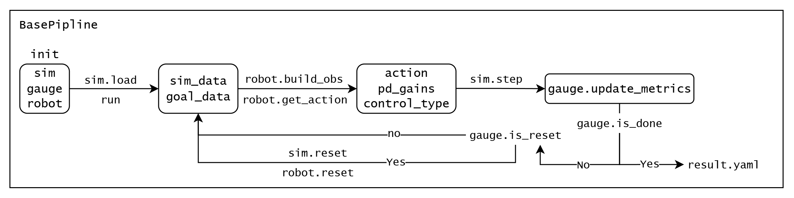
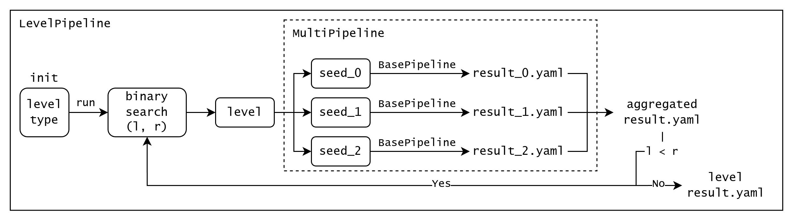

# Robot Gauge

本仓库提供一系列**强化学习训练的运动控制模型指标**, 目标是衡量模型的以下信息, 以衡量Sim2Real间隙:
- 鲁棒性: 随机变化地形, 地面类型(环境摩擦、弹性系数), 模型是否能继续稳定控制
- 稳定性: 电机出力是否合理, 长时间运行是否导致电机过热, 是否出现极端关节位置
- 控制稳定性及准确性: 对于速度追踪指令, 能否准确追踪; 对于目标点指令, 到达误差大小

能间接地衡量模型部署在真机上的效果, 该流程使用Mujoco进行自动化指标评测, 全部代码基于Python实现.

## 支持机器人
| 机器人型号 | 机器人类型 | 速度追踪指令 |
| - | - | - |
| Unitree go2 | 四足 | ✅ |

## 安装
参考[PyTorch官网](https://pytorch.org/get-started/locally/)安装2.0以上任意版本, 安装本仓库

```bash
git clone https://github.com/wty-yy/RoboGauge.git
pip install -e .
```

## 目录结构
- `robogauge/scripts`: 启动指标测试程序
- `robogauge/tasks`: 定义测试任务
- `robogauge/utils`: 常用工具

## 指标/目标/地形
指标的计算方法是通过在环境中发送固定指令及持续时长, 通过Mujoco获取所需参数并计算.

### 环境参数
#### 域随机化
所有的评测指标都会先配置相应的域随机化参数, 在随机参数下进行评测, 以下为常用的域随机化参数

| 参数名称 | 变量名 | 范围 |
| - | - | - |
| 电机动作执行随机延迟 | `action delay` | `<= RL控制间隔` |
| base负重 | `base mass` | `-1, 0, 1, 2, 3 kg` |
| 地面摩擦力 | `friction` | `0.4, 0.7, 1.0, 1.3, 1.6` |

#### 地形
1. 支持legged_gym中的部分地形, 包括: `wave, slope, stairs up, stairs down, obstacles, flat`, 除`flat`地形外其他地形可进行难度系数提升
2. 地面类型 (影响接触摩擦系数, 弹性摩擦系数), 包括: 橡胶地, 木地板, 瓷砖地

### 指标
目前在每个`env.step`后可度量的指标, 所有指标均要求**越大越好**, 目前支持:

| # | 指标名称 Metrics | 描述 | 包含的超参数 | 归一化系数 | 变化 |
| - | - | - | - | - | - |
| 1 | `dof_limits` | 关节超出软关节范围的大小 | 软关节范围阈值 | 总关节变化范围 | `1-x` |
| 2 | `lin_vel_err` | 线速度L2误差 | NA | 总线速度指令范围 | `1-x` |
| 3 | `ang_vel_err` | 角速度L2误差 | NA | 总角速度指令范围 | `1-x` |
| 4 | `dof_power` | 电机耗能 | 缩放系数 | 100 | `1-x` |
| 5 | `orientation_stability` | 机身姿态稳定性 (Roll) | NA | NA | `1-x` |
| 6 | `torque_smoothness` | 力矩平滑度 | 缩放系数 | 30 | `1-x` |

### 速度追踪目标
针对在虚实迁移中发现的问题, 整理指标 (metrics) 内容如下:

| # | 描述 | 标准化范围 | 对应真机问题 | 地形 |
| - | - | - | - | - |
| 1 | 关节出现极端值的比例 | 关节范围 | 移动时发生危险的高抬腿行为 | Any |
| 2 | 线速度与指令速度的L2误差 | 最大线速度指令 | 移动时可能无法达到指定速度 | Any |
| 3 | 角速度与指令速度的L2误差 | 最大角速度指令 | 移动时可能无法达到指定速度 | Any |
| 4 | 高速移动/速度对角突变base高度变化 | 固定高度 | 高速移动时机身存在趴低问题, 速度发生对角突变时无法平衡 | 平地 |
| 5 | 高速移动急停稳定性 | 固定用时 | 楼梯上静止时, 关节不稳定 | Any |

总结速度最总目标 (goals) 如下:

| # | 目标名称 Goals | 描述 | reset条件 | 最大reset次数 |
| - | - | - | - | - |
| 1 | `max_velocity` | 单一维度的最大线/角速度 | 每次执行一个方向的指令, 再急停 | 6 |
| 2 | `diagonal_velocity` | 对角线速度变化 | 每次执行一对对角指令 | 8 |
| 3 | `target_pos_velocity` | 比例差分控制到达目标位置 | 到达目标位置或超时 | 1 |

## 创建新任务
评测任务注册在[`tasks/__init__.py`](./robogauge/tasks/__init__.py)中完成, 包含四个部分:
- BasePipline: 标准Pipline一般无需修改
- MujocoConfig: 仿真器配置文件, 一般无需修改
- BaseGaugeConfig: 指标配置文件, 参考下文创建新指标
- RobotConfig: 机器人配置文件, 参考下文创建新机器人
### 新指标
在`robogauge/tasks/gauge`下创建新的场景、评估指标
### 新机器人
在`robogauge/tasks/robots`下创建新机器人、配置控制模型, 参考`go2`配置
- [go2.py](./robogauge/tasks/robots/go2/go2.py)控制模型, 包含观测构建和动作输出两个函数, 继承`BaseRobot`
- [go2_config.py](./robogauge/tasks/robots/go2/go2_config.py)配置文件, 包含机器人模型xml路径, 控制模型路径, 观测构建参数, 关节映射顺序, 各类缩放系数, 控制频率等

## 注意事项
### 导入新机器人/控制模型
1. 在Robot中创建新的机器人xml文件时, 需包含力矩控制`actuator`, 传感器`sensor - jointpos, jointvel, imu (framequat, gyro, accelerometer)`, 参考[`go2.xml`](resources/robots/go2/go2.xml), **注意: actuator的顺序需要和joint顺序一致, 该顺序称为mujoco关节顺序**
2. 控制模型相关位置位于[`RobotConfig.control`](robogauge/tasks/robots/base_robot_config.py)中, 不同仿真中关节顺序可能不同, 需保证`mj2model_dof_indices`从mujoco映射到模型训练的关节次序配置正确 (IsaacGym次序和Mujoco相同), 其他模型配置需保持一致

## 代码架构
### Pipeline逻辑

[BasePipeline](./robogauge/tasks/pipeline/base_pipeline.py)用于管理仿真`sim`, 度量器(控制指令, 指标计算)`gauge`, 机器人运控模型`robot`三者的调度, 并包含异常处理, 域随机化, 观测噪声的添加.



[MultiPipeline](./robogauge/tasks/pipeline/multi_pipeline.py)用于多进程启动不同seed, 域随机化参数下的`BasePipeline`, 并合并结果文件.

[LevelPipeline](./robogauge/tasks/pipeline/level_pipeline.py)对于当前的环境配置, 找到环境地形下模型能稳定通过(三个seed均通过)的最高地形难度.



